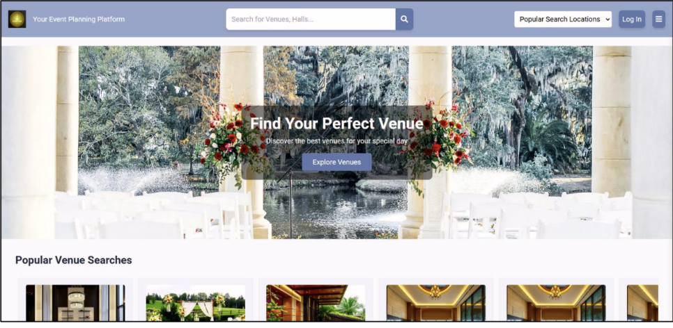
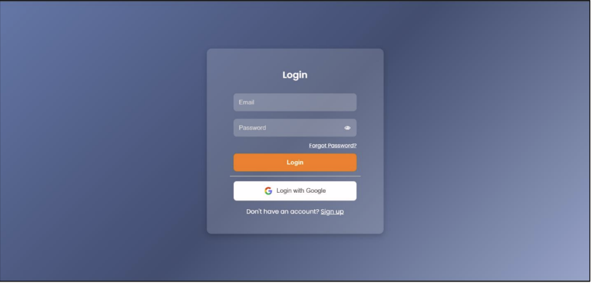
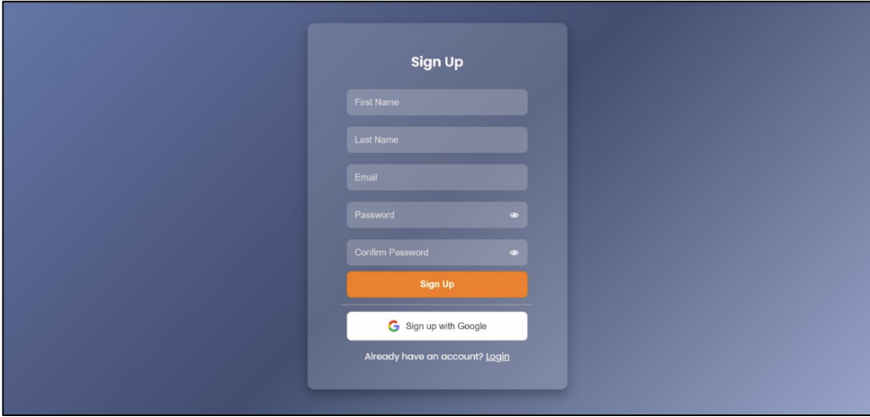
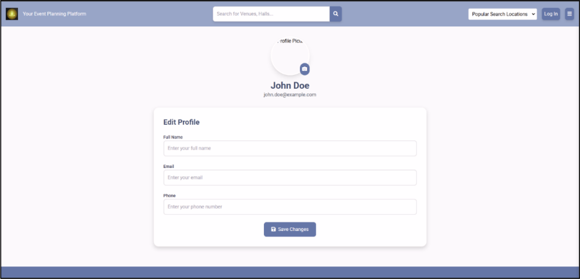
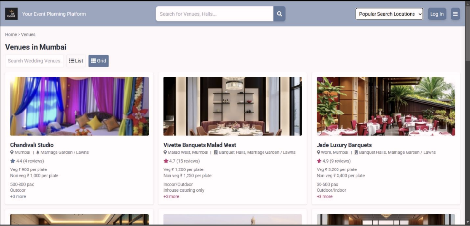

# EventHub – Event & Venue Booking Web Application

## Overview
EventHub is a web-based platform that allows users to browse, book, and manage event venues with customizable services such as catering and room service.

## Features
- User login and registration
- Venue browsing and booking flow
- Responsive user interface
- Room service request module with auto-expiry links
- About Us and Contact Us pages

## Tech Stack
- HTML
- CSS
- JavaScript
- PHP
- MySQL

## Screenshots
### Home Page

### Login Page

### Signup Page

### User Profile Page

### Popular Location Page

## How to Run the Project
1. Place the project folder inside `xampp/htdocs`
2. Start Apache (and MySQL if required)
3. Import the database into phpMyAdmin
4. Open `http://localhost/EventHub/` in a browser

## Future Improvements
- Online payment integration
- Admin dashboard
- Real-time availability updates

## Author
Saniya Khan  
LinkedIn: https://www.linkedin.com/in/saniya-khan-0591b5273
